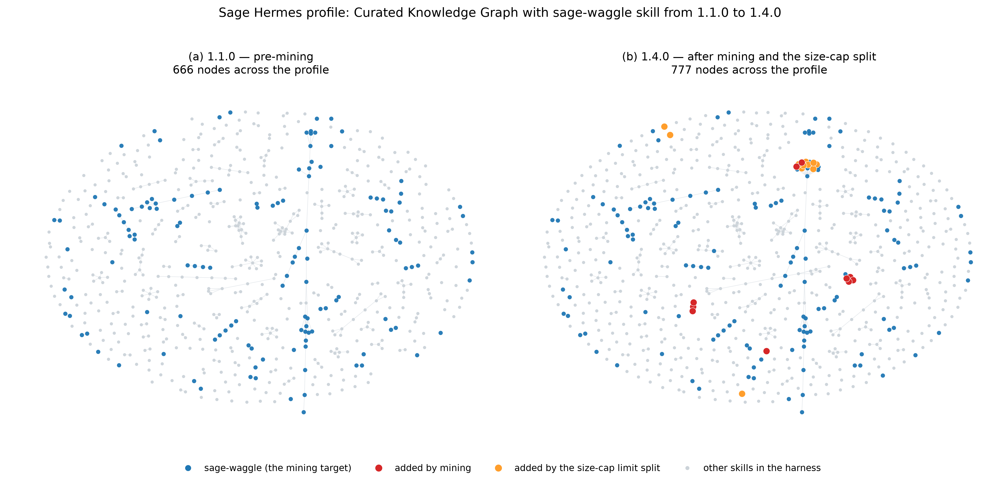
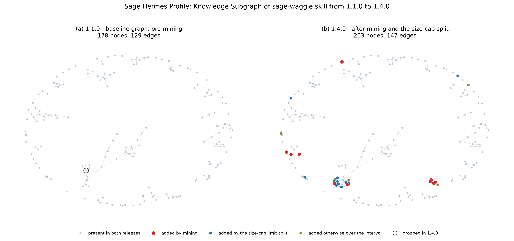

# Improving a Shared Agent Profile from Student Debugging Transcripts

---

## Abstract

A shared agent profile can accumulate workarounds without correcting the guidance
that made them necessary. We studied whether student debugging transcripts could
supply evidence for revising a common Hermes profile used at the 2026 SAGE summer
camp. Of 30 students, 14 profiles were recovered: two usable uploads, eleven node
harvests, and one repaired upload. Eleven contained transcripts, comprising 9,077
messages and 4,424 tool calls.

The pipeline segmented these records into 331 episodes, triaged all episode
digests against a baseline coverage map, and consolidated 53 findings into ten
candidate reference pages. Nine were classified as corrections or qualifications
of existing guidance. In a deterministic BM25 evaluation against profile 1.2.0,
all ten targeted tasks changed from fail to pass, while five regression guards
continued to pass at k ∈ {1,2,3,5}. These are retrieval and phrase-presence results,
not measurements of agent task completion. A canary on one camp node checked
claims from six candidates, including one partial check, and corrected a draft
that mistook silent GPU omission for an explicit command failure.

A subsequent packaging change reduced the skill index from 117,644 to 85,771
characters. Its separate probe suite retained one regression at k=2. Graph diffs
separate the ten mined pages from repackaged content and unrelated additions.

The study supports transcript mining as a complement to memories and skills:
transcripts preserve debugging sequences and expose repeated friction, while
artifacts can also contain decisive corrections. It does not isolate the effect
of transcript access from changes in triage and evaluation, or establish improved
student outcomes. Its main contribution is an auditable process for turning
observed failures into bounded, testable documentation changes.

---

## 1. Introduction

A shared agent profile — instructions, skills, and reference documentation loaded by
every instance — is a piece of infrastructure that ages. The people best positioned
to find its defects are the users who hit them, but they rarely file reports; they
work around the problem and move on.

A hackathon makes that feedback unusually recoverable. Fourteen students each ran an
agent that could modify its own profile, on identical hardware, against a common
task family, for a week. Every prompt, tool call, failure, and eventual fix was
logged. The question this work asks is not *whether* to mine that record, but
**what, in it, is the right thing to mine** — and what a pipeline has to do to turn
the answer into documentation a reviewer will accept.

### 1.1 Setting

- **Cohort.** 2026 SAGE summer camp. 30 students on 26 NVIDIA Jetson AGX Thor edge
  nodes (some blades shared), running the Waggle/SAGE stack (k3s, `pluginctl`,
  ECR, pywaggle).
- **Agent.** Hermes with a shared `sage` profile (SOUL.md, AGENTS.md, a
  `sage-waggle` skill of ~111 reference files). Agents could edit their own copy.
- **Recovery.** After camp, **14 of 30** profile copies ("brains") were recovered —
  2 directly usable uploads, 11 harvested from assigned nodes, and 1 repaired
  upload (§2.1). Each contains agent-written skills, a
  MEMORY.md, and a `state.db` SQLite transcript.

### 1.2 The pipeline

```
recover brains  ->  segment into episodes  ->  triage every episode
   ->  corroborate across students  ->  draft candidates
   ->  grade retrieval offline  ->  verify on hardware  ->  release
```

Each arrow is a place the work can go wrong, and most of what we have to report is
attached to one of them. §2 covers recovery and de-identification, §3 the five
mining and grading stages and the harness validation run before any of them, §4
what came out, §5 the single result we consider most important, and §6 the stages
that failed or mis-measured and what we changed as a result.

Three design decisions distinguish this pipeline from the obvious version of it, and
each is defended empirically later in the paper:

| Decision | The obvious alternative | Why it matters | Evidence |
| --- | --- | --- | --- |
| Read `state.db` **transcripts alongside artifacts** | mine only agent-written markdown | debugging sequences help reconcile incomplete or conflicting summaries | §4.4 |
| **Semantic** triage of *every* episode against a coverage map | a keyword list over selected passages | a keyword list can only find gaps someone already thought of | §3.2 |
| Grade by **retrieval@k + actionability within retrieved text** | bag-of-words presence over the whole tree | a term present *somewhere* in a 1.6 MB tree is neither findable nor actionable | §5 |

A prior pass over this same corpus took each of the alternatives in that right-hand
column, mining the 19 agent-created `SKILL.md` files plus 10 `MEMORY.md` files with a
fixed keyword list and grading by bag-of-words presence. It shipped three additive
pages into profile 1.2.0 and established the provenance discipline this pipeline
reuses unchanged: quarantine → diff → atomic evidence → candidate → A/B → human
review. Where its outputs bear on a result here — as the control corpus in §6.2, and
as the page corrected by HV2-0005 in §4.4 — we say so; otherwise this paper is about
the pipeline, not the comparison.

### 1.3 Contributions

1. **A transcript-mining pipeline**, reported stage by stage, that segments agent
   sessions into **episodes** with *structural* (deliberately non-topical) friction
   signals, so discovery generalises to subjects the designers did not anticipate.
2. **An A/B harness** grading **retrieval@k** and **actionability within retrieved
   text only**, which is deterministic, offline, LLM-free, and re-runnable by a
   reviewer.
3. **Ten evidence-backed candidates** with full provenance, nine of them corrections
   of shipped guidance, shown as a before/after knowledge-graph diff at two zoom
   levels (§4.6) in which the mined pages are separated from concurrent unrelated
   growth by origin rather than lumped together as volume.
4. **A live hardware canary** that checked claims from six candidates (one partially) and
   **falsified a detail in one**, establishing that transcript evidence alone is not sufficient to ship a
   correction.
5. **A set of negative and calibration results** we consider the most transferable
   part of the work (§6), including a hallucinated miner claim, a resolved
   inter-miner contradiction, a control-selection error we caught late, a
   documentation writing rule discovered by the retrieval harness, and a perfect A/B
   score returned by a suite that could not observe the change it was grading.

---

## 2. Corpus

### 2.1 Acquisition: the instructed path recovered 2 of 30 brains

The corpus is not a dataset that was handed to us. Recovering it was the first
methodological problem of the project, and the recovery rate is itself a result
worth reporting: **the collection procedure the camp actually documented returned
2 usable brains out of 30 students.** Eleven more were harvested from the hardware by instructors, and one malformed
upload was repaired.

Students were told to contribute their brain at end of camp
(`hermes-profile/README.md`, and the *End of camp — contribute your brain
(required)* checklist in `hermes-agent.md`): refresh the Graphify graph, run
`hermes profile export sage -o ~/sage-brain-export.tar.gz`, and push the tarball
to `brain-exports/` in their own `sage-summer-camp-2026` repository, from which
instructors would pull. The instruction was explicit, marked required, and
repeated in two documents.

Four students uploaded something. Two of the four uploads were structurally
wrong — one rooted at `default/` and one at `skills/` rather than `sage/`,
because `hermes profile export` was not the command that produced them. So the
self-service path yielded **2 directly usable brains from 30 students**, a 6.7%
directly usable upload rate. We read this less as a failure of the students than of the
design: the contribution step lands in the last hour of a week-long camp, after
the work it is meant to preserve is already done, and nothing in the loop tells a
student their upload was malformed.

Everything else was harvested. Each student had an assigned Jetson AGX Thor blade
— infrastructure provisioned and administered by the project and loaned for
the week — with the profile at `<student-home>/.hermes/profiles/sage/`.
The collection records describe instructor access to that directory; hardware
ownership alone does not establish permission to publish its contents (Appendix C).
For the 26 students without a validated upload we resolved
the Unix account on the assigned node, confirmed that exact path, and archived the
directory in place with `tar`. We deliberately did **not** run `hermes profile
export` on the node: export is a lossy, opinionated view of a profile, and the
transcripts this paper is built on live in state databases that a profile export
does not necessarily carry. Archiving the directory takes the brain as it sat.

The harvest is described step by step in `hermes/private/plan.md`, and every
student's outcome is recorded in `hermes/private/audit.tsv` (30 rows: source,
node, archive size, SHA-256, validation verdict, and the exact failure reason):

| Acquisition path | Students | Recovered |
| --- | ---: | ---: |
| Self-uploaded to GitHub / Hugging Face (the instructed path) | 4 | **2** |
| SSH harvest from the assigned Thor | 26 | **11** |
| — node's reverse-tunnel socket refused on both attempts | 11 | 0 |
| — account resolved, but `~/.hermes/profiles/sage/` absent | 4 | 0 |
| **Total** | **30** | **13 validated** |

A fourteenth brain was recovered by repair rather than by collection: one of the
two malformed uploads was rooted at `skills/`, and since its contents were
otherwise a complete profile, `clean_public_archive.sh` normalises such a root
into `sage/` on extraction. That brain is the 14th in the corpus below. The other
malformed upload (rooted at `default/`) was not a `sage` profile and is excluded
by name from the cleaning script; it remains in the private tree, unused.

Before repair, 17 students lacked a validated archive; after repair, 16 remained
unrecovered. Two properties of the initial 17 matter for interpretation, and we flag them
here rather than in §7 alone. First, **the dominant failure is infrastructural,
not behavioural**: 11 of the 17 losses are nodes that refused their reverse-tunnel
socket on both attempts, and both malformed uploads belonged to students whose
nodes were also offline — 13 students in total blocked by unreachable hardware.
Whether that student's week produced anything worth mining is simply unknown.
Only 4 of 17 are a substantive absence: the account resolved and
`~/.hermes/profiles/sage/` was not there. Second, **node failures are correlated
across students**: some blades were shared, so one dead node removes two students
at once (2 of the 9 refusing hosts were shared pairs). The recovered set is
therefore not a random sample of the cohort but a sample of *students whose
hardware was still reachable weeks after camp*, which is a plausible correlate of
how heavily the node was used. §7 carries this as a limitation.

### 2.2 De-identification: what a raw brain contains that a public one must not

A raw brain is a live home directory, not a document. The 13 validated archives
totalled 29.5 GB and contained credential files (`auth.json`, `.env`),
virtualenvs, model and image caches, sandbox trees, and the agent's own `home/`.
None of that is shareable and almost none of it is evidence.

Two scripts in `hermes/scripts/` do the conversion, and both are committed so the
transformation is auditable rather than described:

- `clean_public_archive.sh` extracts each private tarball under a `sage/` root
  with a fixed exclusion list applied at both the `tar` and filesystem levels
  (`home/`, `bin/`, `lsp/`, `.venv-graphify/`, the caches, `sandboxes/`,
  `workspace/`, `hooks/`, and the credential files by name), normalises
  non-standard roots as described above, then re-packs.
- `redact_secrets.py` then rewrites the surviving text files, replacing seven
  classes of secret pattern (OpenAI-style `sk-`, `hf_`, `ghp_`, `gho_`, Slack
  `xox*`, `Bearer` headers, and generic `api_key`/`token`/`password`/`secret`
  assignments) with `[REDACTED]`. It reports how many files it changed, per
  student, into the batch audit.

What survives is what the study needs: memories, skills, sessions, the state
databases holding the transcripts, profile docs, and Graphify artifacts. The
result is `hermes/public/archives/<student_node>/<student_node>_public_sage.tar.gz`,
one per student, and these are the only brain artifacts in the repository. **The
~30 GB of raw archives were deleted after the public ones validated** — they were
too large to track and contained material no redaction pass should be trusted to
have caught exhaustively.

Every archive, private and public, was validated before use: nonzero size, valid
gzip stream, readable tar index, no absolute paths, no `..` traversal, every
entry rooted under `sage/`, expected profile content present, and a recorded
SHA-256. No two brains were byte-identical. The per-student results are in
`hermes/private/audit.tsv` and `hermes/public/graphify-update-audit.tsv`.

The archive paths and acquisition audits retain student/node keys. Episode-level
citations in the narrative do not make the underlying corpus anonymous. In
particular, `redact_secrets.py` scans selected text extensions and names; it does
not inspect SQLite databases, even though `state.db` is retained. These scripts
therefore support a claim of targeted cleaning, not complete de-identification.
Appendix C distinguishes the recorded handling from checks still needed before
public redistribution.

### 2.3 The corpus

Measured over the 14 recovered brains before any filtering:

| Quantity | Count |
| ---: | --- |
| Brains collected | 14 |
| Brains with transcripts | 11 |
| Sessions | 140 |
| Messages | 9,077 |
| User turns | 635 |
| Tool calls | 4,424 |
| Tool failures | 529 |
| Transcript characters | 13.5 M |
| Sum of episode elapsed spans | 237.8 h |
| Agent-created skills | 19 (0 with evals) |

Three of 14 brains have no transcript traffic and contribute only artifacts.
The 19-skills/0-evals figure reproduces an independent count made over the same
brains by an earlier artifact-based pass, a useful agreement check. The 237.8 hours
sum elapsed spans within episodes; they are not active compute time or measured
student effort, and concurrent sessions can overlap.

---

## 3. Method

```
Stage 0  freeze + inventory            cohort_stats.py
Stage 1  transcripts -> episodes       build_corpus.py
Stage 2  semantic triage               make_digests.py + baseline_index.py + 6 LLM miners
Stage 3  corroborate + consolidate     corroborate.py + analyst merge
Stage 4  retrieval A/B                 retrieval_eval.py
Stage 5  bundle + human review         build_bundles.py
```

Stages 1, 3b, 4 and 5 are deterministic and need no network, GPU, or LLM. Stage 2 is
the only LLM-dependent step; its outputs are committed so the rest replays exactly.
The design principle across the whole method is to keep the LLM confined to the one
judgement that genuinely requires it — *would the baseline agent have gotten this
right?* — and to make every gate around it mechanical and re-runnable. Each stage
below states what it produces and, where the choice was not obvious, the evidence
that it was the right one.

### 3.1 Stage 1 — episodes, and why the signals are structural

`build_corpus.py` segments each session into **episodes**: consecutive user-turn spans (each request and its assistant/tool responses),
packed to an approximately 24,000-character rendered budget. An episode can contain
multiple requests, and long debugging arcs can cross episode boundaries.

Each episode carries friction signals chosen so that **none is topical**:

- `retry_depth` — the longest run of consecutive *failing* calls to the same tool.
  This is the sharpest available marker of a genuine knowledge gap: the agent kept
  trying the same thing and kept losing.
- `n_tool_failures`, `failure_rate`, `wall_seconds`
- `resolved` — a failure run ending in a clean call. The highest-value shape,
  because symptom *and* fix are both present in the record.
- `user_frustration` — short corrective user turns after a failure, matched on the
  brevity and a fixed list of negation/correction words after a detected failure.
  This is a lexical heuristic, but not a domain-topic filter.

Failure detection also uses explicit tool status fields and generic error-pattern
matches. These heuristics can misclassify quoted errors or miss silent failures;
`resolved` denotes a clean tool call after a failure, not verified task completion.
The design constraint is that no domain-topic list determines eligibility.
This is what allows the pipeline to surface subjects nobody put on a list.

**Result:** 331 episodes; 174 contain failures; 138 are resolved arcs; 60 have
`retry_depth ≥ 2`.

### 3.2 Stage 2 — semantic triage against a coverage map

**Friction ranks episodes; it never gates them.** All 331 episodes are digested
(~2.2k chars: the ask, later user turns, tools used, heads of failing tool results),
batched, and read by six LLM miners operating on disjoint slices. Each miner is
given a **baseline coverage map**: every one of the 111 profile files with its
title, lead paragraph, and section headings.

The brief instructs miners to judge novelty *semantically* — would the baseline
agent have gotten this right? — to name which baseline files they checked, to read
the full episode before promoting anything ambiguous, and to de-identify. It
explicitly forbids topic filtering: an episode about an unexpected subject is as
eligible as one on a covered topic.

All digests are eligible regardless of topic. Discovery remains bounded by the
recovered corpus, digest truncation, the coverage map, and miner judgement; reading
every digest is not equivalent to reading every full transcript.

**Result:** 53 hits from ~173 full-episode reads (23 high, 30 medium confidence).

**Validation of the ranking choice.** The lowest-friction batches produced 10 hits,
including an entire cluster of vLLM findings. A friction *threshold* — the obvious
efficiency move — would have discarded them. We report this because the temptation
to gate on friction is strong and, on this corpus, wrong.

### 3.3 Stage 3 — corroboration, then semantic consolidation

`corroborate.py` merges the six shards and scores clusters by **independence** (the
number of distinct students), weighted by miner confidence and generality, with
friction as a tiebreaker. Recurrence across students strengthens a finding, but does not establish statistical
independence: students shared instructions, infrastructure, and sometimes nodes.
Distinct-student counts are corroboration counts, not independent replications.

Lexical clustering is treated as a **hint for a semantic pass, never a decision**,
and it behaved as expected: 51 clusters from 53 hits, only 1 corroborated
automatically, and it split the highest-independence finding of the whole corpus
across six separate clusters. A semantic consolidation step (`consolidate.py`, with
its merge map recorded as auditable data) reduced 51 clusters to 28 themes under two
stated rules:

> Merge iff one profile page would satisfy every claim in the group. Split whenever
> symptom or diagnostic differs, even under shared vocabulary.

**Result:** 28 themes → 19 promoted, 9 held. Twelve themes are corrections of
shipped baseline text; two of those are held (§6.6), and two of the promoted ten
merge into a single page, giving the **nine correction candidates** of §4.3.

### 3.4 Stage 4 — the A/B harness

No candidate ships on an author's judgement that it reads well. `retrieval_eval.py`
grades two things per task, and a task counts as improved only if **both** hold:

1. **Retrieval.** BM25-rank the corpus against the task query; does a file that
   answers the question land in the top *k*? Control and treatment are ranked over
   their *own* corpora, so a new page that **demotes** an existing answer registers
   as a regression.
2. **Actionability.** Is the required symptom/cause/fix triad present **within the
   retrieved top-*k* text only** — not anywhere in the tree?

The implementation concatenates the top-k documents, then checks required phrases
using case-insensitive, whitespace-normalised substring matching. Required phrases
can therefore be spread across retrieved pages; the test does not establish that
one page contains a coherent or correct procedure. A retrieval hit separately
requires a path matching the task’s accepted answer-file list. We use
“actionability” below as the harness field name for this **phrase-presence proxy**.
BM25 is a deliberate choice: deterministic, dependency-free, no LLM, no GPU, re-runnable
offline by a reviewer.

The task set is 15: 10 targeted at candidates, and 5 **regression guards** drawn from
knowledge already in the baseline.

### 3.5 Harness validation, run before any candidate existed

Sanity run with **control == treatment == baseline 1.2.0**, *k*=3:

```
control=112 files  treatment=112 files  k=3
  IMPROVED 0   REGRESSION 0   both_pass 5   both_fail 10
```

Three necessary properties, established before the harness could be trusted:

1. **No self-improvement artefact** — identical corpora yield 0/0, as they must.
2. **The 5 guards are valid guards** — they pass on the current baseline, so a later
   failure means a candidate demoted something, not that the task was unsatisfiable.
3. **The 10 targeted gaps are real** — all fail on the baseline, so the candidates are
   not being graded against straw tasks.

**And the value of the second condition is visible right here.** Two targeted tasks
report `actionable=1, retrieval_hit=0` in the control: the required phrases *are* in
the top-*k* text, but no file that answers the question was retrieved. A
presence-based grader scores these as **covered**. Under retrieval@k they correctly
score as **failures**, because an agent cannot act on text it never loads.

---

## 4. Results

### 4.1 Funnel

```
14 brains  ->  11 with transcripts
 9,077 messages / 4,424 tool calls / 13.5M chars / 237.8 agent-hours
      |
      v  Stage 1  segmentation
   331 episodes   (174 with failures, 138 resolved arcs, 60 retry_depth>=2)
      |
      v  Stage 2  semantic triage, 6 parallel miners, every episode read
    53 hits       (~173 full-episode reads; 23 high / 30 medium confidence)
      |
      v  Stage 3  corroboration + semantic consolidation
    51 lexical clusters  ->  28 themes
      |
      v  Stage 3b analyst judgement
    19 promoted  ·  9 held  ·  12 correction themes (10 promoted -> 9 candidates)
      |
      v  Stage 5  bundling
    10 candidate bundles (HV2-0001 .. HV2-0010), full provenance
      |
      v  Stage 4  retrieval A/B vs 1.2.0
    10/10 targeted IMPROVED  ·  0 regressions  ·  5/5 guards hold
```

### 4.2 A/B

Control = 112 markdown files (profile 1.2.0, fingerprint `971479c99bb63355` — see
§6.2 on establishing that this is the right tree). Treatment = 122 (control + 10
proposed).

| k | IMPROVED | REGRESSION | both_pass | both_fail |
| ---: | ---: | ---: | ---: | ---: |
| 1 | 10 | 0 | 5 | 0 |
| 2 | 10 | 0 | 5 | 0 |
| 3 | 10 | 0 | 5 | 0 |
| 5 | 10 | 0 | 5 | 0 |

The five `both_pass` rows are the regression guards passing in control *and*
treatment — the desired outcome: pre-existing knowledge stayed retrievable while ten
pages were added.

### 4.3 Candidates

| ID | Title | Students | Correction? | Baseline it contradicts |
| --- | --- | ---: | --- | --- |
| HV2-0001 | Agent HOME rewrite | **9** | gap | — (uncovered) |
| HV2-0002 | sudo allowlist & image import | 2 | **yes** | `SKILL.md` ×6: `sudo k3s ctr images import` |
| HV2-0003 | pluginctl GPU needs `runtimeClassName` | 2 | **yes** | `runtime-packaging-patterns.md:106` |
| HV2-0004 | Podman/CDI GPU passthrough | 2 | **yes** | `SKILL.md:660`, `docker-build-deploy.md:73` |
| HV2-0005 | Host PyPI torch D-state hang | 1 | **yes** | `thor-host-cpu-dev-first.md` |
| HV2-0006 | conda-forge/pixi has no sm_110 | 1 | **yes** | host envs uncovered |
| HV2-0007 | `snapshot.data` is RGB, not BGR | 1 | **yes** | `reolink-http-snapshot.md:54` |
| HV2-0008 | Camera offline dev (no camera attached) | 1 | **yes** | camera guidance assumes a camera |
| HV2-0009 | Off-node `Plugin()` thread failure | 1 | **yes** | "Local testing" section |
| HV2-0010 | Node-local registry x509 trust | 1 | **yes** | ImagePullBackOff causes |

**Nine of ten were classified as corrections or qualifications of shipped guidance.** This is the
pipeline's most consequential output property and it was not a goal we set: nothing
in the brief asks miners to prefer corrections. It follows from mining the arc of a
student getting stuck, which is disproportionately often an arc in which the
documentation was the thing that misled them.

### 4.4 Four findings, and what in the pipeline reached them

**1. The HOME rewrite (HV2-0001)** — the agent's shell runs with `HOME` rewritten
into the profile directory, so every `cd ~/project` resolves somewhere that does not
exist.

| Metric | Value |
| --- | ---: |
| Students affected | **9 of 11** with transcripts |
| Episodes containing the rewritten path | **52** |
| Explicit `cd … No such file or directory` failures | 18 |

The earlier artifact pass did not surface this recurring harness issue. Its generic
error text is difficult to distinguish from a typo without context. The 52 episodes
contain the rewritten path; only 18 record an explicit failed `cd`, so 52 should
not be read as 52 verified failures. Reading the surrounding arcs connected these
observations into the most broadly corroborated theme in the corpus. Downstream cost recorded in-transcript: a cold container store under the
rewritten HOME forced a ~5.5 GB base-image re-pull.

**2. The impossible procedure (HV2-0002)** — `SKILL.md` instructs
`sudo k3s ctr images import` in six places, labelled CRITICAL and "required for local
testing". The camp sudoers allowlist, printed in-transcript, is
`kubectl, docker, docker-compose, runplugin, pluginctl`. **`k3s` is not on it**, and
the agent's terminal has no TTY, so there is no password prompt to answer. The
documented procedure is not inconvenient; it is unreachable. Note what this does to
a presence-based grader: every keyword is in the tree six times over, so the topic
scores as thoroughly covered. Only asking whether the *retrieved* page lets the agent
act catches it.

**3. A page frozen one day before its own correction (HV2-0005)** — the shipped
`thor-host-cpu-dev-first.md` prescribes exporting `CUDA_VISIBLE_DEVICES=` before
importing torch. The transcripts show this is insufficient: `import torch` *itself*
enters uninterruptible D-state on Blackwell CUDA init even with the variable empty,
and the process cannot be killed with SIGKILL. That page was written from an
artifact-based pass over this same student's MEMORY.md. The same MEMORY.md, further
down, records the corrected rule:

> "UPDATE 2026-07-24: import torch ITSELF hangs in D-state (triggers CUDA runtime
> init even with `CUDA_VISIBLE_DEVICES=''`). D-state procs can't be killed with
> SIGKILL. Training scripts must NOT import torch at module level."

The earlier page used the July 23 guidance even though the same MEMORY.md
contains a July 24 correction. This is a failure to reconcile evidence over time,
not proof that artifacts cannot preserve corrections. The transcript supplies the
debugging sequence; the memory supplies an explicit update. A stronger extraction
process reads both and resolves superseded claims before drafting. The host hang
was not reproduced by the canary (§4.5), so its mechanism remains a transcript-based
interpretation rather than an independently isolated cause.

**4. Silent wrongness (HV2-0007)** — pywaggle's `ImageSample.__init__` applies
`cv2.cvtColor(data, COLOR_BGR2RGB)` on construction, so `snapshot.data[...,0]` is
red. The baseline states the opposite. A student settled it by measuring:

```
snapshot.data mean per channel: [ 70.84  116.52   43.16]
raw cv2 BGR mean per channel:   [ 42.93  115.93   70.93]
```

Channels 0 and 2 transposed, empirically. A plugin author following the baseline
publishes silently colour-swapped images, with **no error message at all** — the
failure class that survives to production.

### 4.5 Live canary

Every result above is textual. Since nine of ten candidates *correct* shipped text,
and a stale correction is worse than none, we ran a canary on a camp Thor
(`node-H039`) six weeks after camp.

| Candidate | Claim | Verdict |
| --- | --- | --- |
| HV2-0002 | sudo allowlist excludes `k3s` | **CONFIRMED** (config) |
| HV2-0003 | pluginctl pods get no GPU without `runtimeClassName` | **CONFIRMED** (causal A/B) |
| HV2-0004 | CDI is the working GPU flag | **CONFIRMED + corrected** |
| HV2-0006 | Thor is sm_110; NVIDIA container works | **CONFIRMED** (partial) |
| HV2-0007 | `snapshot.data` is RGB | **CONFIRMED** (source + runtime) |
| HV2-0008 | `Camera()` raises a misleading `TypeError` | **CONFIRMED** |
| HV2-0005, 0001, 0009, 0010 | — | **NOT TESTED** (§7) |

**The GPU result is causal, not correlational.** Two pods, identical but for one
line, same image, same node selector:

| Pod | `runtimeClassName` | `torch.cuda.is_available()` | `/dev/nvidia*` |
| --- | --- | --- | ---: |
| `v2-noclass` | *(absent)* | **False** | 0 |
| `v2-withclass` | `nvidia` | **True** | 5 |

And `pluginctl deploy --dry-run` emits that field in **none** of plain,
`--selector resource.gpu=true`, or `--privileged` — independently confirming the
miner's negative result that `--privileged` is not a substitute, since it sets a
different field entirely. The `nvidia` RuntimeClass exists on the node and the node
advertises `resource.gpu=true`. **On this node and image, the pod without the RuntimeClass had no visible GPU.**
This isolates the field’s effect in the tested configuration; it does not establish
that every deployment or software version silently falls back to CPU.

**The canary falsified a detail in one candidate.** The draft of HV2-0004 said
`--gpus all` fails. It does not:

| Flag | Result |
| --- | --- |
| `--runtime=nvidia` | `Error: default OCI runtime "nvidia" not found` |
| `--gpus all` | **exit 0, zero `/dev/nvidia*` injected** |
| `--device nvidia.com/gpu=all` | works — 4 devices injected |

Exiting 0 while injecting nothing is strictly more dangerous than erroring. The page
was rewritten with the measured table and a **device-count** check rather than an
exit-status check. The canary checked claims from six pages, one only partially. Four pages remain
untested, and the conda-forge/pixi failure in HV2-0006 was not reproduced. This
coverage does not support an estimated error rate for the untested claims.

### 4.6 What the baseline gained, as a knowledge graph

The profile ships a Graphify knowledge graph over its own skills and docs, which the
agent queries before grepping. Diffing that graph across releases gives a
structural view of what mining added, independent of the retrieval A/B.

Two figures carry that diff, at two zoom levels, and they are meant to be read
together. **Figure 2** is the wide shot: the whole curated harness, showing where
`sage-waggle` sits among the profile's other skills and how large the mining delta
is against all of it. **Figure 1** is the zoom: the same two releases with
everything outside `sage-waggle` cropped away, so the added pages resolve
individually and can be told apart by where they came from. Both use the same
before/after construction — 1.1.0 on the left, 1.4.0 on the right, one layout
computed on the union of the two graphs so a node present in both panels sits at
the same coordinates in each. Nothing moves between panels; what changes is what is
*there*. Read wide-then-narrow, the pair answers two different questions: how much
of the harness this touched, and what specifically arrived.

Per §6.2 we state the provenance rather than the branch name. Each graph records
the commit it was built from: the baseline graph is `396c687` (2026-08-10,
`distribution.yaml` version **1.1.0**) and the treatment graph is `233d5ef`
(2026-09-03, version **1.4.0**). The shipped graph was only ever rebuilt at those
two points, so 1.1.0 and 1.4.0 are the only two states of the graph that exist to
compare. We treat 1.4.0 as the next version of the profile: the intermediate
releases were minor steps toward it, and in hindsight they would have been better
numbered that way.

| Release | sage-waggle files |
| --- | ---: |
| 1.1.0 (`396c687`, baseline graph) | 122 |
| 1.4.0 (`233d5ef`, treatment graph) | 148 |

**Grouping the releases is not the same as grouping the additions.** What Figure 1
keeps separate is the *kind* of contribution, because that is what the confound turns
on: of the 25 added pages only **10** came out of this pipeline, **11** are the
size-cap split re-routing content the skill already had (§6.7), and **4** arrived by
other routes.
Crediting all 25 to mining would overstate the result by 2.5x, so Figure 1 colours
by kind even though it reports a single interval.

**The whole-profile diff does not measure mining, and we report it only to dismiss
it.** Between the 1.1.0 baseline and 1.4.0 the full graph grows 12,966 -> 13,243
nodes over 1,818 -> 2,105 source files. Of the 349 newly contributing files, **26 are
in `sage-waggle`** — the mining target, and only 10 of those are the mined pages —
and 323 are unrelated skills that changed
for their own reasons over the same interval (`omniverse-realtime-viewer` 16,
`tilegym-cutile-python` 15, `physical-ai-defect-image-generation` 12, and a long
tail). A whole-profile figure would credit mining with a 277-node gain that is 93%
unrelated growth. The curated visualization graph is worse than uninformative here:
`.graphifyignore.curated` excludes `**/references/**`, and every mined page is a
reference page, so *the mining contribution is exactly zero dots in that view* while
the skill split moves it 410 -> 524. We flag this because the confound is invisible
in the artifact a reader would naturally be shown. The shipped curated artifact is
in fact worse than stale-by-scope: `graphify-baseline-viz.tar.gz` is byte-identical
at both releases (built at `868d039`, before either), so it was never rebuilt across
the interval at all. **Figure 2** is the honest version of that zoomed-out view —
the curated scope rebuilt at each release, with `skills/sage-waggle/**` re-admitted
so the mined pages are visible against the rest of the harness.



**Figure 2 — the wide shot: what mining added, against everything else the profile
carries.** The curated overview filter (one card per skill) with
`skills/sage-waggle/**` re-admitted at full page resolution, rebuilt at each
release rather than reused from the shipped artifact. Blue is the mining target;
grey is every other skill in the harness. Red marks the ten mined pages and orange
the eleven routed by the size-cap limit split — twenty-one dots that are absent on
the left and present on the right. 666 -> 777 nodes across the profile, of which
131 -> 156 are in `sage-waggle`.

**Figure 2 is deliberately unflattering.** Communities are regrouped one-per-skill,
because the Louvain ids inherited from the 13k-node full graph shred under
filtering (777 nodes into 420 communities, 297 singletons) and colour the
interactive render as noise; the static export goes further and draws
everything outside the mining target as a single grey bucket, since a printed legend
cannot name a dozen groups. What the wide shot shows is a small, legible addition to
a large harness — which is the correct impression, and the reason to show it before
the zoom rather than after. It also shows the addition is *local*: the twenty-one
new dots land inside and around one skill's territory, not scattered across the
profile.

**Scoping to `skills/sage-waggle/**` removes the unrelated growth; attribution by
kind does the rest.** Scope alone is not enough — the interval also contains the
size-cap split and three pages predating this pass — but within the subtree no files
were removed and no unrelated work landed, so every added page falls into one of the
four kinds above, and the delta is attributable.

One *node* did drop: the bare `pywaggle` concept node Graphify had extracted from
`SKILL.md`, which disappeared when the split moved that content into routed pages —
the 17 other pywaggle-related nodes survive and 1.4.0 adds 4 more. We note it
because Figure 1 rings it, not because it bears on the result:

| | 1.1.0 | 1.4.0 |
| --- | ---: | ---: |
| Nodes | 178 | 203 |
| Edges | 129 | 147 |
| Markdown pages indexed | 108 (of 109 in tree) | 133 (of 133) |
| Communities | 71 | 82 |
| `pitfalls-*` pages | **0** | **11** |

The 25 new pages partition exactly by kind: **10** are
the mined candidates (HV2-0001..0010), **11** are the routed pitfalls
pages from the size-cap split (§6.7), **3** predate this pass
(`thor-host-cpu-dev-first`, `plugin-verification-invariants`,
`ml-plugin-patterns-thor-base-image` — the 1.2.0 control of §6.2), and **1** —
`cloud-trigger-patterns` — is neither. That page is present in the 1.1.0 *tree* and
has been since the profile's first commit, but is absent from the 1.1.0 *graph*: the
shipped baseline graph indexes 108 of the subtree's 109 markdown pages. It appears
"new" only because the baseline artifact was stale, which is worth stating precisely
because it is the same class of unverified-baseline hazard as §6.2, caught here by
diffing the graph against the tree rather than trusting it.



**Figure 1 — the zoom: the same interval inside `skills/sage-waggle/**`, coloured by
where each added page came from.** 178 -> 203 nodes, 129 -> 147 edges. Grey is
present in both releases. Red is the ten mined pages, blue the eleven routed by the
size-cap limit split, olive the five that are neither — the four pages above plus
the subtree's container node. The open ring in panel (a) is the one node that
dropped. Same shared layout as Figure 2, so again nothing moves between panels.

**Figure 1 is where the gain becomes legible as knowledge rather than as volume.**
The twenty-one dots that were a small fraction of Figure 2 are, at this scope, the
visible difference between the two panels — and the colour separates them by origin,
which the wide shot cannot do at 777 nodes. Three things read directly off it. The
red nodes are absent on the left and present on the right: that is the mining
result, ten pages, and it is what the rest of the paper is about. The blue nodes are
the size-cap limit split, and they are the reason scope alone does not settle
attribution — they arrived over the same interval and would otherwise be counted as
mining. The olive nodes are the remainder, including the one stale-baseline artifact
discussed above. Where the red nodes land is informative too: the ten fall into
**four** distinct graph communities — runtime-class configuration for GPU pods
(4 pages), camera-plugin development without a camera attached (3), the Sage/Waggle
skill core (2), and sudo policy on camp Thor accounts (1) — rather than clustering
in one place. That is what mining a transcript corpus looks like when it works:
the pages cover several failure themes observed across the recovered cohort.

Read as a pair, the two figures make the modest claim precisely. Figure 2 says the
mining touched one skill out of a large harness. Figure 1 says that within that
skill the addition is real, attributable, and distributed across the topics students
actually got stuck on.

We stress the modesty of this result. **+25 nodes is not the paper's finding** — the
retrieval A/B in §4.2 is, and a knowledge graph cannot distinguish a page that
corrects shipped guidance from one that merely adds to it, which is the distinction
§4.3 turns on. The graph shows *reach*: the mined pages are indexed, clustered with
their topical neighbours. Graph inclusion does not by itself establish retrieval. It does not show that they are *right*;
§4.5 and §6.1 are where that is contested, and one of these very pages was
falsified on hardware after being indexed here.

---

## 5. The result we consider most important

On task **V2-T05**, the control retrieves `thor-host-cpu-dev-first.md` **at rank
1**, scoring 21.9 — the single most relevant page in the baseline for a query about
a hung `torch.cuda.is_available()`. A topically relevant page is retrieved, but
it is not an accepted answer file for this task: the recorded `retrieval_hit` is
false. This row therefore fails both gates; it does not isolate actionability
failure while holding the retrieval gate true.

The task still fails. The retrieved text is missing `D-state` and `module level`:

```
control:   top_k[0] = references/thor-host-cpu-dev-first.md   (21.90)
           retrieval_hit = False   (the page does not answer the question)
           actionable    = False   missing: ["D-state", "module level"]
treatment: top_k[0] = references/thor-host-torch-hang.md      (35.91)
           retrieval_hit = True    actionable = True
```

The row illustrates why topical relevance alone is insufficient. It does not
record an agent executing either page: the missing phrases are a documentation
check, and any claim that the treatment prevents a hang requires an execution test.

**Coverage is not the ability to act**, demonstrated on real shipped text rather than
argued. This is the whole justification for the second grading condition of §3.4,
and it is the same mechanism behind two field observations in the corpus: an agent
asserting "edge nodes have no disk" while the baseline documented local caching
across three files, and an agent steering a student away from ECR as "broken
fleet-wide" eleven days after the fix was documented — the stale blocker page
outranked its own correction.

The practical consequence for anyone maintaining an agent knowledge base:
**staleness marking and cross-links matter as much as new prose.** Where two pages
disagree, the newer must say so and the older must point forward.

---

## 6. Negative and calibration results

We report these at length because they are the most transferable part of the work and
the part most often omitted.

### 6.1 The A/B rejected our own draft, and the obvious fix made it worse

The first full run at *k*=3 was clean: 10/10, 0 regressions. Because *k*=3 is
generous, we swept *k*:

```
k=1  IMPROVED 10  REGRESSION 1   <-- V2-R01-nvmap-regression
k=2  IMPROVED 10  REGRESSION 0
k=3  IMPROVED 10  REGRESSION 0
k=5  IMPROVED 10  REGRESSION 0
```

At *k*=1 the new `thor-host-torch-hang.md` (19.60) outranked
`direct-node-testing.md` (21.34 in control) for an nvmap query. Adding a *correct*
page demoted a *different correct* page, and the two failures are easy to confuse:
one hangs forever, one fails fast with a device-permission error.

**Fix attempt 1 made it worse.** We added a disambiguation banner naming the other
symptom (`NvRmMemInitNvmap Permission denied`, `/dev/nvmap`). The score rose from
19.60 to **25.08** — we had fed the competing page's highest-signal query terms into
our own page. A human reading the banner is helped; BM25 read it as "this page is
even more about nvmap".

**Fix attempt 2 worked** — point to the right page without restating its vocabulary:

> **Scope:** this page covers only the case where a CUDA call never returns. A fast
> failure with a device-permission message is a different problem — see
> `references/direct-node-testing.md`.

`nvmap` now appears zero times in the new file. Result: 0 regressions at every
*k* ∈ {1,2,3,5}.

Four things follow. The regression was **invisible at the default *k*** and appeared
only under a sweep — report the sweep, not a single *k*. The harness is not a rubber
stamp; it forced a concrete edit to a shipped artifact. There is a real tension worth
naming: **cross-links that help a human reader can hurt a lexical retriever**, and
the resolution is to name the neighbouring *page* while describing the other symptom
in your own words, never quoting its error strings — a writing rule the harness
discovered, which should be re-tested on other query sets and retrievers. And finally, BM25 rewards
term overlap, so a page can win retrieval for the wrong reason: retrieval@k is a
better proxy than bag-of-words, not ground truth.

### 6.2 We graded against the wrong control — twice, in two different ways

Both working branches were cut from `main`. The prior pass's release branch had
never been merged there, so the working clone's profile was **1.1.0** (109 files),
not the **1.2.0** (112 files) we had pinned as control throughout. The first A/B
therefore graded the candidates against a baseline **missing three pages that had
already shipped** — the easier comparison, and one that silently credits the pipeline
for ground already taken.

This was caught **incidentally**, while checking `distribution.yaml` for an unrelated
reason. No stage of the pipeline could have detected it: every artifact was
internally consistent.

Fixed by extracting the true 1.2.0 tree from the prior release branch and
re-running. **The result did not change** (10/10, 0 regressions) — and the stricter
control produced the study's strongest single result, the V2-T05 case in §5, which
exists only *because* the page it supersedes is present in the control. We then
added a control-corpus fingerprint to the harness output so a reviewer can confirm
which baseline any result was graded against:

```python
# Baseline provenance: grading against the wrong control silently inflates the
# result, and nothing downstream can detect it. Record a fingerprint of the
# control corpus in the output so a reviewer can confirm which baseline was used.
control_fp = hashlib.sha256(
    "".join(f"{n}:{len(t)}" for n, t in sorted(control.items())).encode()
).hexdigest()[:16]
```

This fingerprint hashes file names and character lengths, not file contents.
Equal-length edits leave it unchanged, and the harness records rather than asserts
the expected value. Exact reproduction should pin an immutable commit and a
content hash for both arms; the recorded fingerprint is an inventory check.

**Recommendation for anyone building a comparable harness: make the control's
identity a recorded output, not an assumption.** Provenance discipline on evidence
does not protect you if the baseline itself is unverified.

**The same hazard returned at release time, where it would have been worse.** When we
came to merge the ten pages into a shipping profile, the obvious base was `main` — and
`main` is still 1.1.0, for the same reason. Releasing from it would have shipped the
ten new pages while **silently deleting the three already in 1.2.0**, and would have
left our own `thor-host-torch-hang.md` — a page whose first line declares
that it *supersedes* `thor-host-cpu-dev-first.md` — pointing at a file not present in
the tree. The A/B, graded against a 112-file control, would no longer have described
the shipped artifact at all.

Grading and releasing are two separate opportunities to pick the wrong tree, and the
fingerprint we added after the first mistake only protected the first one. We
therefore fingerprinted the release base before merging (112 files,
`971479c99bb63355`, identical to the control) and re-ran the full sweep against the
**actual released tree** rather than the staged copy, so that the index edit made
during the merge was itself graded: 10/10 improved, 0 regressions, guards 5/5, at
every *k* ∈ {1,2,3,5}.

The generalisation: **fingerprint the tree you release from, not only the tree you
grade against**, and re-run the evaluation on the merged artifact. A result measured
on a staging copy is a claim about the staging copy.

### 6.3 An LLM miner hallucinated a specific, and the defence was not another LLM

One shard reported that loading the whole skill returns ~121.8k chars and is
truncated, observed in 5 episodes across 4 students. Checked against the raw
databases:

| Check | Result |
| --- | ---: |
| Calls naming the skill | 50 |
| …requesting the **whole** skill (no `file=`) | **0** |
| …requesting a single reference file | 50 |
| Payload sizes | min 1,061 / mean 12,152 / max 48,193 chars |
| Any `truncated` flag set | none |

The claim could not be reproduced and did not ship. Two lessons. First, a **trap**:
we had to check the raw databases rather than our own episode renders, because our
corpus builder truncates tool results itself (1,155 elisions) — **our episodes are
inadmissible evidence for any claim about output size or truncation.** A pipeline's
own lossiness can manufacture confirmation of exactly the class of claim it is being
asked to check. Second, the defence that worked was **cheap mechanical re-derivation
from the primary source**, not a second opinion from another LLM.

The *underlying* packaging problem was independently real and did ship: the skill
body is 114,441 chars against a 100,000-character cap (`MAX_SKILL_CONTENT_CHARS`),
which the preceding pass had grown to 115,072. We promoted the verified half and dropped the
unverified half. The packaging problem is measured here and discharged in §6.7.

**A third lesson, from our own later error on the very same fact.** We initially
sourced that cap from a student's MEMORY.md paraphrase ("limit 100KB") and reported
the file's size in **bytes**. Both were sloppy. The authoritative statement is in the
Hermes skill-authoring documentation — "≤ 100,000 chars (enforced as
`MAX_SKILL_CONTENT_CHARS`)", byte-identical across all 13 brains carrying it and
citing the validator as its source of truth; this study did not inspect that
implementation — and the cap is reported in **characters**, which
this file's multi-byte content makes materially different from bytes. Our reported
overage was inflated by roughly a percentage point everywhere it appeared, including
in a draft of this paper.

The failure is instructive precisely because it is *not* the LLM's: a human read a
paraphrase, adopted its unit, and propagated it. §6.3's stated defence — re-derive
from the primary source — is the right one, and we did not apply it to a number we
had classified as already verified. **"Verified" should record which source verified
it and in what unit**, or the verification does not survive re-use. The finding's
direction was never in doubt; only its magnitude, which is exactly the kind of error
that a provenance discipline focused on *claims* rather than *quantities* will miss.

### 6.4 Miner disagreement localises where adjudication is needed

Two shards produced contradictory claims about `sudo`. One: camp accounts have
NOPASSWD sudo for an allowlist. The other: the agent terminal **cannot run `sudo` at
all** — no TTY, so *every* `sudo` call fails. Both cite real quotes. We resolved it
against the corpus rather than trusting either:

| Signal | Count |
| --- | ---: |
| Episodes with `sudo: a terminal is required…` | 9, across 5 students |
| Episodes with a **successful** sudo call | 92, across 8 students |

Every binary near a TTY failure is **off** the allowlist (`k3s`, `apt-get`,
`nvidia-ctk`, `systemctl`, `usermod`, `cat`). The truth is the conjunction: sudo
works for allowlisted binaries; anything else needs a password, and with no TTY and
no askpass helper it fails with a message the agent should read as *"this binary is
not on the allowlist"* rather than *"sudo is unavailable"*.

The over-general claim, promoted verbatim, would have taught the next agent to
abandon `sudo pluginctl` — a capability supported by successful sudo calls in 92 episodes. It was
rated only *medium* confidence, which is the pipeline behaving correctly. **A
single-pass keyword miner has no analogue of this**: nothing to disagree with, and no
way to notice the over-generalisation.

### 6.5 Lexical clustering under-merges, by design and in fact

51 clusters from 53 hits, 1 corroborated automatically, with the highest-independence
finding in the corpus split across six clusters. Treating lexical similarity as a
decision rather than a hint would have destroyed the flagship result. Semantic
consolidation is not an optional refinement.

### 6.6 What was deliberately held back

Nine themes were **not** promoted. The clearest case: a fleet-wide web-tool outage
that shaped 26 of 331 episodes and produced a documented integrity failure (a
blocked agent filled metadata with unrelated stock photos rather than reporting the
tool as unavailable). It is a genuine cohort finding and it is reported as one — but
a profile page describing a broken pip package is stale the moment the fleet is
reprovisioned. **Provisioning state is not platform knowledge.** Also held: a
provider-layer bug (out of scope), site-specific hardware findings,
version-specific API notes, and one genuinely novel toolchain finding that needs its
own page and a live re-run before it can ship.

### 6.7 The size cap we reported, and the A/B that could not see us fix it

§6.3 measures a packaging problem and stops there. `sage-waggle/SKILL.md` was 114,441
characters when this pass began, 115,072 after the preceding pass, and indexing our
ten pages added a further 2,572 — so what 1.3.0 actually shipped was **117,644
characters** against the
100,000-character `MAX_SKILL_CONTENT_CHARS` cap — 17.6% over. The arithmetic is the
point: making ten pages retrievable required growing the one file that makes them
findable, and this is a structural property of the pipeline's last stage rather than
a one-off — any pass that ships pages pays it. We shipped 1.3.0 with that debt
recorded rather than silently unindexing the pages. A follow-up pass (profile
**1.4.0**) discharged it, and produced the sharpest calibration result of the whole
study.

**The fix followed from measuring, not from trimming.** The soft guidance in the same
authoring document — peer skills sit at 8–14k chars; split past 20k — reframes the
hard cap as a symptom. Against the other 250 skills in the profile `sage-waggle` was
not marginally over but a **3× outlier** (next largest: `graphify`, 38,370; median
~12,000), and the weight was concentrated in one section:

| section | chars | share |
| --- | ---: | ---: |
| `## Pitfalls` (85 flat bullets, no subheadings) | 50,556 | 43.0% |
| `## Plugin Development` | 24,901 | 21.2% |
| `## See Also` (88 entries) | 20,593 | 17.5% |
| 11 other sections | 21,594 | 18.3% |

`## Pitfalls` alone was larger than the largest sibling skill in the profile.
Trimming 15% to squeak under the cap would have treated the symptom; the file had
regrown every time anyone added to it and would again. We extracted `## Pitfalls`
into **11 topic-grouped `references/pitfalls-*.md` pages**, leaving a one-line
routing stub per entry in the index — bold label, symptom clause, and the entry's
key command. 13 of the 85 bullets already ended in a `references/…` pointer, so the
change extends an established pattern rather than inventing one. Content integrity
was checked by substring assertion rather than by eye: 84 of 85 blocks are present
byte-for-byte on the new pages, and the 85th was a verbatim duplicate, collapsed.
**117,644 → 85,771 chars**, 14,229 under the cap.

**Then the instrument failed, silently and in our favour.** Run against the 15
original tasks, the split scored **15/15 `both_pass` at every *k***: zero
regressions, a perfect sheet. It was also worthless. None of those 15 tasks retrieves
pitfall content, so no possible outcome of the edit could have moved any of them. A
clean result from an instrument that cannot see the change is not evidence of a safe
change; it is evidence of nothing, and it is indistinguishable from success at the
point of reading.

We wrote 15 new probes against pitfall content specifically
(`evals/pitfall_probes.json`), each phrased as the symptom a student would actually
type. The targeted suite immediately found a real regression the original suite could
not:

| suite | *k*=1 | *k*=2 | *k*=3 | *k*=5 |
| --- | --- | --- | --- | --- |
| pitfall probes (15) | 8 IMP / 0 REG | 8 IMP / **1 REG** | 8 IMP / 0 REG | 4 IMP / 0 REG |
| original tasks (15) | 15 both_pass | 15 both_pass | 15 both_pass | 15 both_pass |

`P04-k3s-reimport` fell from pass to fail, for two separable reasons, both fixed at
the level of the rule rather than the instance:

1. **The stub dropped the searchable token.** Trimming the bullet to a one-liner lost
   `sudo docker save … | sudo k3s ctr images import -` — the exact string a searcher
   types. The generator now guarantees every stub carries its block's key command
   span, for all 84 stubs, not just the one that failed.
2. **A catch-all group acted as noise.** One page mixed doc discipline, SSH/tmux and
   notifications; it matched many queries weakly and outranked the correct page. It
   was split into three coherent pages (9 groups → 11).

**One regression remains at *k*=2, and is reported rather than tuned away.** The
correct page sits at rank 3, so *k*=2 misses it while *k*=1 fails in both arms; *k*=3
and *k*=5 are clean. Removing it would mean fitting the corpus to a single probe,
which is the failure mode the harness exists to prevent.

**Why the split helps retrieval is measurable, not asserted.** A 117k index is one
enormous BM25 document that matches *something* in nearly every query. Across all 30
queries in both suites:

| corpus | SKILL.md in top-3 | median rank |
| --- | ---: | ---: |
| control (117k monolith) | 10/30 | 6 |
| split (86k) | 5/30 | 7 |

The monolith ranks higher more often, but as a **catch-all rather than a precise
match**. That is why 8 probes improved — a focused page beats a monolith on its own
topic — and it is equally why P04 regressed at *k*=2: content that had been
guaranteed-present inside a document that always ranks becomes one hop away. Both
directions are the same mechanism. The honest summary is that splitting **trades a
broad weak signal for a narrow strong one**, which is a good trade for a reader who
must act on what they retrieve, and a slightly worse one for a reader who only skims
the top two hits.

Two levers were deliberately left unpulled so the A/B had exactly one variable:
`## See Also` (20,492 chars, 88 entries) is uncompressed, and 35 of 130 `references/`
pages are still never cited from the index — unreachable by an agent reading it,
costing no characters but suffering the same disease of material added without a
routing path. Reaching the 8–14k peer range at all would require splitting
`sage-waggle` into several skills, which changes the `description`/`triggers` surface
evaluated on every turn and would invalidate this baseline. The cap does not force
it; the door is left open.

**The through-line of this section.** The same failure appeared three times at three
different stages of the pipeline: *an instrument that cannot see the thing being
changed reports success.* A presence-based grader over-credits coverage because
keyword presence cannot see whether a page is retrieved (§3.4, §5). The control tree
was wrong twice, and every artifact downstream was internally consistent with it
(§6.2). And here a suite returned 15/15 on a change none of its tasks could observe.
In all three, the number was true and the reading of it was worthless. The
discipline that generalises is a question to ask before trusting any green result:
**what would have to appear in this evaluation for a failure to be visible?** If the
answer is *nothing*, the evaluation is not evidence, however clean it looks — and a
clean sheet is precisely the condition under which no one thinks to ask.

---

## 7. Limitations

- **The canary checks claims from 6 of 10 candidates, one partially.** Four remain
  transcript-based, and HV2-0006’s conda-forge/pixi failure was not reproduced.
  One corrected draft demonstrates the need for verification, not an error-rate
  estimate for the remaining claims.
- **The canary ran as root; students were non-root.** Configuration-level findings
  (sudoers, CDI, RuntimeClass, pod specs, library source) transfer directly. Claims
  about what a *student* is permitted to do were **read from configuration, not
  experienced**.
- **One candidate is unsafe to reproduce on shared hardware.** HV2-0005's entire
  claim is that the process is unkillable by SIGKILL and clears only on reboot;
  testing it risks leaving that state for the next user. It needs a node with a
  scheduled reboot window.
- **BM25 is a proxy.** It rewards term overlap; a page can win retrieval for the
  wrong reason. Better than bag-of-words, not ground truth.
- **One retrieval regression ships in 1.4.0.** `P04-k3s-reimport` fails at *k*=2 only
  (the correct page ranks 3); *k*=3 and *k*=5 are clean, *k*=1 fails in both arms. It
  is left in rather than tuned out — see §6.7.
- **The pitfall probes were written by us, after the split existed.** They are
  adversarial in intent and they did catch a real regression, but they are not a
  held-out set, and a suite authored with the treatment in view can flatter it. The original 15 tasks predate the split, but candidate prose was revised against
  their results (§6.1). Neither suite is an untouched held-out evaluation of the
  final documentation. The k sweep tests retrieval depth, not generalisation to
  new queries.
- **Episodes are lossy** (1,155 truncation elisions) and inadmissible for claims
  about output size — see §6.3.
- **3 of 14 brains have no transcripts.**
- **The recovered set is not a random sample of the cohort.** 14 of 30 brains were
  recovered, and the dominant loss was hardware that had gone unreachable by
  collection time rather than anything about the student (§2.1). If node
  reachability correlates with how heavily a node was used, the corpus is biased
  toward *more*-used nodes, which would inflate per-brain activity relative to the
  cohort. Counts in §2.3 are therefore properties of the recovered set, not
  estimates of the camp.
- **Independence is bounded by cohort size.** Most themes rest on 1–2 students; only
  the HOME rewrite has broad corpus-wide confirmation.
- **Stage 2 is not deterministic.** Miner outputs are committed so downstream stages
  replay exactly, but a re-run of the miners would not reproduce them exactly.
- **No student outcome study.** We measure profile quality, not learning. Whether
  these pages would have changed what students accomplished is untested and is the
  obvious next experiment.
- **n = 1 cohort, one hardware class, one agent harness.** The findings are specific;
  the method is what we claim generalises.

---

## 8. Interpretation and next evaluation

The study changes several factors together: transcript access, semantic triage,
consolidation, and the grading rule. It therefore cannot attribute the findings to
transcripts alone. Nor can observed debugging establish the counterfactual that a
student would have succeeded with the revised profile. The common starting profile
makes comparison useful, but local edits and shared infrastructure remain possible
confounders.

A next evaluation should freeze both profile trees by content hash, hold out
students or sessions before mining, and derive new tasks without viewing candidate
pages. Run baseline and revised agents on the same tasks, with matched model and
tool settings, and score completion, repeated failures, and time or tool-call cost.
Separate transcript-only, artifact-only, and combined evidence under the same
triage and grading procedure to test the contribution of each source. Hardware
checks should include the student permission context and document software versions.

## 9. Conclusion

Student debugging records yielded ten evidence-backed reference pages, classified
as one uncovered gap and nine corrections or qualifications of existing guidance.
The final pages improved all ten targeted retrieval/phrase-presence checks while
preserving five guards. One-node verification caught an incorrect detail before
release; the later packaging evaluation exposed a remaining retrieval regression.

The practical result is a reviewable chain from episode to claim, candidate, test,
and release. The evidence supports using transcripts together with artifacts to
find and reconcile documentation defects. Improved agent completion and student
outcomes remain to be measured.

---

## Appendix A — Reproduce

```bash
python3 hermes/foundry-v2/tools/build_corpus.py    --brains .work/brains --out .work/corpus
python3 hermes/foundry-v2/tools/baseline_index.py  --profile ../summer-camp-2026/hermes-profile \
                                                   --out .work/corpus/baseline_map.json
python3 hermes/foundry-v2/tools/make_digests.py    --corpus .work/corpus
# Stage 2: 6 parallel LLM miners over .work/corpus/digests -> .work/triage/*.json
python3 hermes/foundry-v2/tools/corroborate.py     --triage-dir .work/triage \
    --episode-index .work/corpus/episode_index.json --out .work/corpus/corroborated.json
python3 hermes/foundry-v2/tools/consolidate.py
python3 hermes/foundry-v2/tools/build_bundles.py
python3 hermes/foundry-v2/tools/retrieval_eval.py \
    --control .work/control_120 --treatment .work/treatment \
    --tasks hermes/foundry-v2/evals/tasks.json \
    --out hermes/foundry-v2/evals/ab_results.json --k 3
```

Verify the control with the fingerprint in `ab_results.json`
(`control_fingerprint: 971479c99bb63355`, 112 files).

The 1.4.0 skill split (§6.7) regenerates and re-grades independently:

```bash
# Deterministically regenerate the 11 pitfall pages and the 84 routing stubs.
# Run from the sage-waggle skill directory; rewrites SKILL.md in place.
python3 hermes/foundry-v2/tools/split_blocks.py \
    --skill SKILL.md --out .work/split/blocks.json      # 85 blocks
python3 hermes/foundry-v2/tools/split_pitfalls.py \
    --blocks .work/split/blocks.json                    # -> 85,771 chars
# A/B the split against the released 1.3.0 tree, on both suites
python3 hermes/foundry-v2/tools/retrieval_eval.py \
    --control <released 1.3.0 sage-waggle> --treatment <1.4.0 sage-waggle> \
    --tasks hermes/foundry-v2/evals/pitfall_probes.json \
    --out hermes/foundry-v2/evals/split_pitfall_k3.json --k 3
```

## Appendix B — Artifacts

| Artifact | Path |
| --- | --- |
| Student-facing contribution instructions (§2.1) | `summer-camp-2026/hermes-profile/README.md`, `summer-camp-2026/hermes-agent.md#end-of-camp--contribute-your-brain-required` |
| Harvest procedure (§2.1) | `hermes/private/plan.md` |
| Per-student acquisition audit, all 30 (§2.1) | `hermes/private/audit.tsv`, `hermes/private/audit-summary.md` |
| De-identification pipeline (§2.2) | `hermes/scripts/clean_public_archive.sh`, `hermes/scripts/redact_secrets.py` |
| Cleaned public brains (the analysed corpus) | `hermes/public/archives/<student_node>/<student_node>_public_sage.tar.gz` |
| Graphify batch over the public brains | `hermes/scripts/update_public_graphify.sh`, `hermes/public/graphify-update-audit.tsv` |
| Method notebook | `notes/00-method.md` |
| Findings log (F1–F12, chronological) | `notes/01-findings-log.md` |
| Results | `notes/02-results.md` |
| Canary | `notes/03-canary.md` |
| Skill split under the size cap (§6.7) | `notes/04-skill-split.md` |
| Candidate bundles + provenance | `candidates/HV2-000{1..10}/` |
| A/B results, k-sweep, tasks | `evals/` |
| Proposed pages (camp repo, staging branch) | `hermes-profile/docs/proposals/foundry-v2/` |
| Released profile 1.3.0 | `summer-camp-2026@hermes-profile-1.3.0-release` |
| Post-merge A/B on the released tree | `evals/ab_released_130.json`, `evals/sensitivity_k_released_130.json` |
| Pitfall probe suite (15, §6.7) | `evals/pitfall_probes.json` |
| Split A/B, both suites, k-sweep | `evals/split_pitfall_k{1,2,3,5}.json`, `evals/split_original_tasks_k3.json` |
| Split generator + block parser + group map | `tools/split_pitfalls.py`, `tools/split_blocks.py`, `tools/split_groups.py` |
| Split release notes (camp repo) | `hermes-profile/docs/proposals/skill-split/README.md` |
| Released profile 1.4.0 | `summer-camp-2026@hermes-profile-1.4.0-skill-split` |
| Figures 1-2 — before/after knowledge-graph diff at two zoom levels (§4.6) | `figures/`, `figures/README.md` |
| Scoping + render tools for the figures | `tools/filter_scope.py`, `tools/filter_curated.py`, `tools/render_scoped.py`, `tools/render_static.py`, `tools/render_overview.py` |

## Appendix C — Ethics and data handling

The collection records describe instructor recovery from project-administered nodes,
limited to the students’ Hermes profile directories. Students were instructed to
contribute their profiles. These facts document the collection process; they do
not by themselves establish consent for public transcript release or an ownership
claim over everything stored on the hardware.

The cleaning scripts exclude named credential files and large runtime directories,
then redact known patterns in selected text files. The acquisition notes report
deletion of the raw archives after validation. However, structural archive validation
and checksums do not verify de-identification. SQLite contents are outside the
text scanner’s scope, and archive/audit naming retains student and node identifiers.
The evidence repository is described as private in the Labs bundle README; a
`public/` directory name is not proof of publication clearance.

Public redistribution would require a documented permission basis and a separate
review of retained database fields, text, filenames, and identifying context.
This paper claims neither complete anonymisation nor completed publication review.
The present analysis uses existing records, does not execute student scripts, and
keeps source brains unchanged. Candidate evidence should retain provenance within
controlled access while publication excerpts minimise identifying information.
